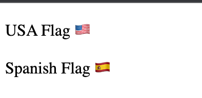

# Emoji flags custom web component

[](https://www.jsdelivr.com/package/gh/kivs/flag-emoji)


## How to install


### Using the [CDN](https://www.jsdelivr.com/package/gh/kivs/flag-emoji)

- Add the script to your html page:

    ```html
    <script src="https://cdn.jsdelivr.net/gh/kivs/flag-emoji@1.0.0/index.js" integrity="sha256-Yxra5AEPCbl9CagfdSbnc+82A5n8G4eIUJq1ODcLmMU=" crossorigin="anonymous"></script>
    ```

### Installing from npm

```bash
npm install @kivs/flag-emoji@1.0.0
```


## Usage

- Add the _HTML_ custom element to the page and add the country code for the flag:

    ```html
    <p> USA Flag <flag-emoji country="us" /> </p>

    <p> Spanish Flag
        <flag-emoji country="ES" />
    </p>
    ```

    

- Create the element with the _DOM API_:

    ```javascript
    const flagEmoji = document.createElement("flag-emoji")
    flagEmoji.country = "jp"
    document.body.appendChild(flagEmoji)
    ```

- Create the element using the `FlagEmoji` class constructor:

    ```javascript
    const flagEmoji = new FlagEmoji()
    flagEmoji.country = "jp"
    document.body.appendChild(flagEmoji)
    ```

- Use the javascript class search utils to find emoji flags by country name or ISO code:

    ```javascript
    // by country name
    FlagEmoji.find_by_name('unit')

    // by ISO/country code
    FlagEmoji.find_by_code('es')
    ```
